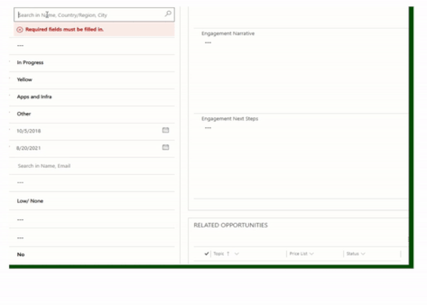

# Generic Lookup PCF Control
## Summary
Using this PCF (Power Component Framework) control, you can have customized Lookup Control in D365 Modern Apps. It is robust, configurable, and extendable. You can use the [managed](/GenericLookupPCFSolution/bin/Release/GenericLookupPCFSolution_managed.zip)  or the [unmanaged](/GenericLookupPCFSolution/bin/Release/GenericLookupPCFSolution.zip) solution files if you do not wish to compile control manually.

## Configuration
Since PCF on lookup control is not yet supported, we are achieving this by creating a dummy field (a type of SingleLine) and bind this PCF control to the dummy field. The lookup control will be configured under the configurations. Make sure to add the actual lookup field on the form and **hide** it. This PCF control will set its value as soon as a record is selected. You can use the same dummy field for any number of lookup fields on the form.

## Sample Screenshots
| Working Solution      | Configuration |
| :---        |    :----:   |
|    |        |

## Sample Config

Find sample config files under [managed](/GenericLookupPCFComponent/sampledata). 

Note: 
1. As of now, the configuration needs provided as part of property **ConfigJSON**
2. You can also call external apis and apply your business logic and return valid resultset. Attaching such sample config for your refference for (**PrimanySponson.json** and web resrouce **LookupExternalAPI.js**) 

